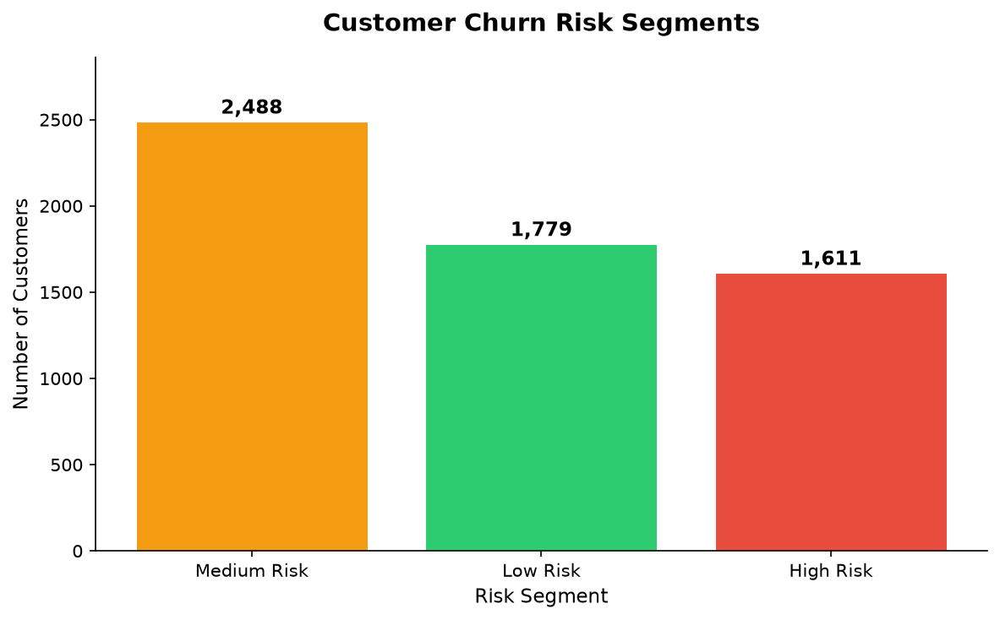
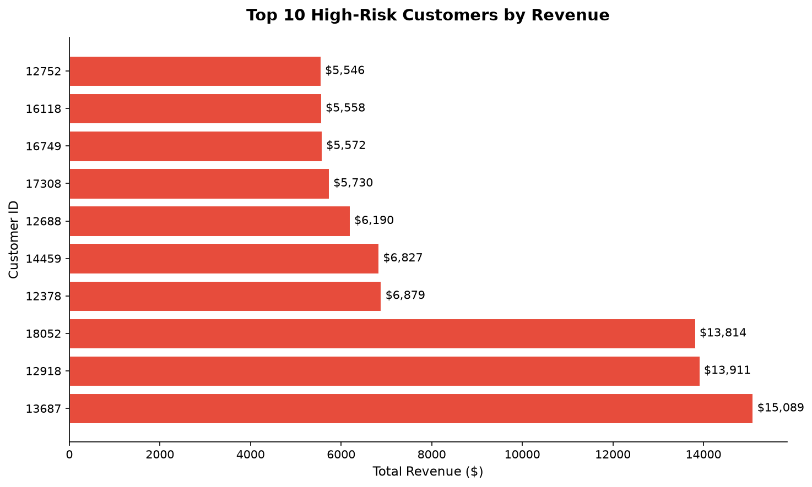
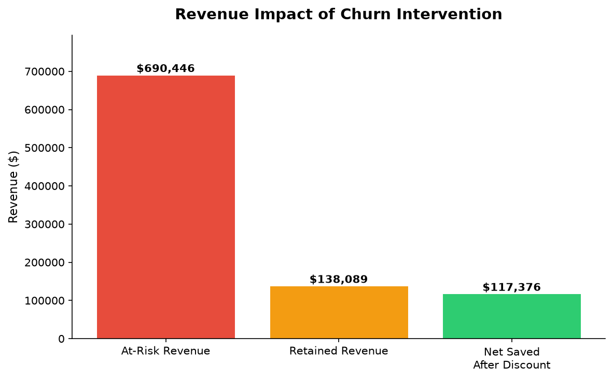

# Customer Churn Prediction & CLV Analysis
### End-to-End Machine Learning Project | Python · XGBoost · Matplotlib

---

## The Business Problem

Customer retention is one of the most cost-effective growth levers for any business. Acquiring a new customer costs 5–7x more than retaining an existing one. Yet most companies only realize a customer has churned *after* they're gone.

This project builds a system that identifies **which customers are at risk of churning before they leave** — and quantifies exactly how much revenue is at stake.

---

## The Bottom Line

> **1,611 high-risk customers represent $690,446 in at-risk revenue.**
> By targeting them with a 15% retention discount, we can realistically save **$117,376 in net revenue** that would otherwise walk out the door.

---

## Dashboard

### 1. Customer Churn Risk Segments

- **2,488** customers are Medium Risk — need monitoring
- **1,779** customers are Low Risk — healthy and active
- **1,611** customers are High Risk — immediate action needed

### 2. Top 10 High-Risk Customers by Revenue

Customer 13687 alone represents $15,089 in at-risk revenue. These 10 customers combined account for over $85,000 — a targeted outreach campaign for just these 10 would have an outsized ROI.

### 3. Revenue Impact of Churn Intervention

| Metric | Value |
|---|---|
| Total at-risk revenue | $690,446 |
| Estimated retained (20%) | $138,089 |
| Discount cost (15%) | $20,713 |
| **Net revenue saved** | **$117,376** |

---

## Methodology

### Data
- **Source:** UCI Online Retail II Dataset (~1M transactions, 2009–2011)
- **Scope:** UK-based online retailer across 43 countries
- **After cleaning:** 5,878 unique customers

### Feature Engineering — RFM
From raw transactions, three behavioral signals were engineered per customer:

| Feature | Definition |
|---|---|
| Recency | Days since last purchase |
| Frequency | Total number of orders placed |
| Monetary | Total revenue generated (USD) |

A customer was labeled **churned** if they had not purchased in the last 90 days relative to the dataset snapshot date.

### Model — XGBoost Classifier
- **Algorithm:** XGBoost (gradient boosted decision trees)
- **Features used:** Frequency, Monetary, Average Order Value
- **Note:** Recency was intentionally excluded to avoid data leakage, since churn was defined using recency
- **ROC-AUC Score: 0.7733**
- **Explainability:** SHAP values used to interpret feature importance

### Churn Risk Segmentation

| Segment | Probability Threshold |
|---|---|
| High Risk | ≥ 70% |
| Medium Risk | 40% – 69% |
| Low Risk | < 40% |

---

## Tech Stack

| Tool | Purpose |
|---|---|
| Python (pandas, numpy) | Data cleaning & feature engineering |
| XGBoost | Churn prediction model |
| SHAP | Model explainability |
| Matplotlib / Seaborn | Data visualization & dashboard |
| scikit-learn | Model evaluation & train/test split |

---

## Project Structure
customer-churn-clv/

│

├── Data/

│   ├── online_retail_II.xlsx       ← Raw dataset (UCI)

│   ├── customer_features.csv       ← Cleaned RFM features

│   ├── predictions.csv             ← Model output with churn probabilities

│   ├── chart1_segments.png         ← Risk segment dashboard

│   ├── chart2_atrisk.png           ← Top at-risk customers

│   └── chart3_impact.png           ← Revenue impact estimate

│

├── Notebook/

│   └── project.py              ← Full pipeline: EDA → features → model → charts

│

└── README.md
